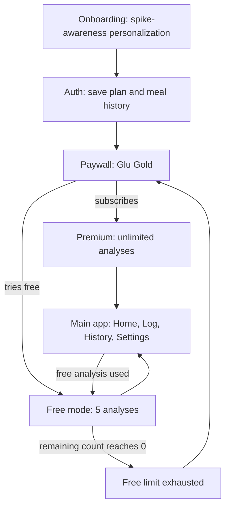
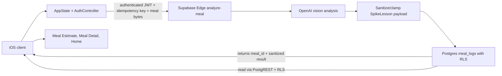

# Design: Glu AI - Eat Freely, Understand the Spike

Generated by /office-hours on 2026-05-02
Branch: main
Repo: OneShottingApps
Status: DRAFT
Mode: Startup

## Source Of Truth

This design doc is the ultimate product source of truth for Glu AI. When `apps/GluAI/design-doc.md` disagrees with `apps/GluAI/design.md`, `apps/GluAI/screens_updated.md`, `apps/GluAI/README.md`, shipped checklists, or archived PRDs, this design doc wins.

The older docs are supporting implementation references and are explicitly up for change:

1. `apps/GluAI/design.md` remains useful for visual direction, Pastel Precision tokens, component expectations, and screen behavior, but it should be revised when it conflicts with this document.
2. `apps/GluAI/screens_updated.md` remains useful for screen and interaction detail, but it should be revised when it conflicts with this document.
3. `apps/GluAI/README.md` remains useful for setup, operational status, and deployment notes, but its product hierarchy should follow this document.

This hierarchy is not limited to one onboarding override. It applies to product positioning, onboarding, copy, AI insight tone, success criteria, and engineering handoff priorities. The medical-segment-heavy onboarding in the supporting docs is replaced by a modern food-abundance and glucose-spike-awareness onboarding. The supporting specs already say Glu AI is not a medical device, not a CGM replacement, and should remain educational (`apps/GluAI/design.md:13-17`, `apps/GluAI/design.md:34-46`). This design doc pushes that product position harder: Glu should not feel like a diabetes app for the wellness-curious v1 bullseye.

The canonical onboarding child artifact is `apps/GluAI/onboarding-spike-awareness.md`. It is binding for ids, titles, subtitles, options, skip behavior, saved fields, reveal mapping, and exact copy. If that artifact ever conflicts with this design doc, this design doc still wins and the artifact should be updated.

## CEO Review Decisions

The 2026-05-02 CEO review resolved the plan in favor of a screen-preserving spike-awareness retrofit with these decisions:

1. Add a first-class Spike Lesson card to Meal Estimate and Meal Detail.
2. Add prompt/eval fixtures and food-freedom guardrails before implementation is considered complete.
3. Enforce the five free analyses server-side, linked to authenticated user identity and an app-scoped device identity.
4. Write the full 19-step spike-awareness onboarding content before coding. The required artifact is `apps/GluAI/onboarding-spike-awareness.md`; engineering must not infer copy, ids, reveal rules, or saved fields from vague direction.
5. Keep product hierarchy explicit: photo first, Spike Lesson second, assumptions/confidence third, steadier move fourth, calories/macros as secondary detail.

## Codex Review Locks

These review findings are implementation blockers, not polish notes:

1. Product writes the canonical 19-step onboarding artifact first: ids, titles, subtitles, options, skip behavior, saved fields, reveal mapping, and exact copy live in `apps/GluAI/onboarding-spike-awareness.md`. JSON, remote config, or bundled resources are downstream exports.
2. Meal UI hierarchy is fixed: photo -> Spike Lesson -> assumptions/confidence -> steadier move -> calories/macros as secondary detail. Calorie goals, remaining calories, target weight, and weight-loss framing are banned.
3. Meal analysis authority moves server-side: authenticated Edge function, quota and entitlement check, OpenAI call, sanitization, persistence, and `meal_id` return.
4. Free-5 quota decrements only after a successful food analysis is shown. `analysis_failed` and `no_food` never decrement; `low_confidence` decrements only when a usable estimate is produced and displayed. Ledger writes are atomic and idempotent.
5. Client RevenueCat state is not authority. The server verifies Glu Gold through a webhook-backed entitlement table or server-side RevenueCat check.
6. Device identity is an app-scoped random Keychain install id that reduces casual reinstall resets only. No fingerprinting, IDFA, cross-app tracking, or adversarial identity claims.
7. Spike Lesson JSON includes `schemaVersion`, `promptVersion`, nullable `risk`, `drivers[]`, and `assumptions[]`.
8. Copy says "likely spike risk from this meal's composition" and never claims personalized glucose prediction.
9. Prompt evals cover rice bowl, pasta, dessert, juice/soda, coffee drink, fried snack, mixed high-protein meal, salad with sweet dressing, hidden-sauce restaurant meal, blurry image, multi-item photo, and non-food.
10. `steadierMove` maps to detected `drivers[]`; generic "add protein/fiber" filler fails eval unless the surfaced driver warrants it.
11. Analytics include expand/read, save after lesson, estimate edits, second meal D1/D7, free-5 exhaustion, and paid conversion after 3+ analyses.
12. Free-5 exhaustion is only a meaningful product signal when paired with D1/D7 repeat logging and paywall conversion.
13. V1 AI output is limited to the Spike Lesson object plus saved meal estimate fields. Home may only derive deterministic summaries from saved lessons; no freeform coach copy ships in v1.
14. App Store/legal lexicon is a ship blocker: approved terms, banned medical phrases, disclaimer placement, privacy labels, and category choice must be signed off.
15. Sequencing is fixed: product copy artifact first, engineering storage choice second.

## Problem Statement

Modern eaters have unprecedented access to food. Delivery, cafes, restaurant meals, snacks, desserts, packaged food, sweet drinks, social meals, and late-night food are now available with less friction than at any prior point in everyday life. The user does not want another restrictive diet app telling them what not to eat. They want to keep food freedom while learning one practical signal for healthier eating: "What is the likely spike risk from this meal's composition — and what's one steadier move for the same food?"

The core problem is not calorie ignorance alone. It is that people can eat almost anything, anytime, but have little immediate feedback about the composition-based spike risk of that choice. Glu AI should make that risk visible through a photo-first meal estimate, then teach one small way to make the same food steadier without shaming the food or the person.

The supporting specs already point in this direction. `design.md` defines the product promise as "Snap a meal. Understand the estimate. Learn the likely glucose context. Save the pattern" (`apps/GluAI/design.md:19-22`) and `screens_updated.md` says every screen should help users understand what they ate, what Glu estimates, what it might mean for glucose awareness, and one small realistic improvement (`apps/GluAI/screens_updated.md:31-38`). This document narrows that language to the approved v1 phrase: "likely spike risk from this meal's composition." It bans personalized glucose prediction language.

## Demand Evidence

Current demand evidence is a market thesis, not validated customer demand. The thesis is that four consumer waves have converged:

- Photo-based food estimation apps have trained users to expect meal understanding from a camera.
- CGM and metabolic health content have made "spikes" legible to wellness-curious users even without a device.
- Modern abundance makes "eat anything, but understand the consequence" more emotionally attractive than restriction.
- Existing calorie apps are too generic, while clinical glucose apps feel too medical for users with no diagnosis.

This is a validation gap. The v1 should be treated as a demand test, not proof that the market already wants this exact product. The first launch should measure whether users repeatedly log meals, view the spike explanation, hit the free-5 ceiling, edit or save steadier-meal suggestions, and convert to Glu Gold.

## Status Quo

The target user currently lives with one of these workflows:

- They use Cal AI or another photo-calorie app and get calories/macros, but not a clear "spike risk" learning loop.
- They use MyFitnessPal or Lose It and tire out because manual logging is slow.
- They follow metabolic-health content but do not have a personal tool at meal time.
- They try a CGM product such as Levels, Lingo, or Nutrisense, but it requires hardware and a higher subscription.
- They use clinical glucose/diabetes apps and bounce because the framing feels like disease management.
- They do nothing and rely on vibes: "this seems healthy" or "this feels heavy."

Glu's wedge is the middle ground: photo-first food awareness with glucose-spike context, educational only, no CGM, no medical identity required.

## Target User And Narrowest Wedge

The bullseye user is a wellness-curious iPhone user with no diagnosis. They eat broadly and do not want a moralized food app. Their inner monologue is:

> I eat what I want, but I want to understand what it does to me from a spike standpoint and how to make it better.

The narrowest wedge worth building is:

1. Take or upload a meal photo.
2. See the spike-risk estimate and Spike Lesson first: why composition may spike, plus steadier-move guidance anchored to detected drivers — before calories/macros feel like equal protagonists (`apps/GluAI/design-doc.md`).
3. See rough calories/macros plus detected food assumptions, confidence, rationale, disclaimer, editable fields only as supportive detail (`apps/GluAI/design.md:757-783`). V1 forbids calorie goals, daily calorie budgets, "remaining calories," weight-loss coaching loops, moralized food judgments, treat/shame framing, restriction-first workflows, CGM-style personalization without a CGM, and deterministic language that claims certainty about someone's blood glucose response (`apps/GluAI/design-doc.md`).
4. Save the meal into a photo-first history.
5. Try five free analyses before the paywall returns, enforced server-side with deterministic quota semantics (`apps/GluAI/design-doc.md`).

This aligns with the existing Log tab being the product heartbeat (`apps/GluAI/design.md:666-674`), Meal Estimate editability (`apps/GluAI/design.md:796-831`), supporting screen brief controls (`apps/GluAI/screens_updated.md`), and Spike Lesson prominence as the spike-teaching artifact (`apps/GluAI/design-doc.md`).

## Constraints

- The app must remain educational only: no diagnosis, prescription, treatment, guaranteed outcomes, or CGM-replacement claims (`apps/GluAI/design.md:34-46`).
- The product tone must be calm, observational, supportive, practical, and non-alarmist (`apps/GluAI/design.md:1075-1095`).
- The app must not call foods "bad," "unsafe," "cheat meals," or "medical results" (`apps/GluAI/design.md:1097-1120`, `apps/GluAI/screens_updated.md:1004-1041`).
- The paywall may be conversion-oriented, but not manipulative, fear-based, or medically claiming (`apps/GluAI/design.md:355-424`, `apps/GluAI/screens_updated.md:409-475`).
- Free mode is five total meal analyses with visible remaining count and predictable paywall return (`apps/GluAI/design.md:325-351`, `apps/GluAI/screens_updated.md:427-460`).
- V1 remains photo-first. Manual food database search, barcode scanner, voice logging, saved meals, restaurant guidance, wearables, CGM integration, labs, clinician export, and full AI Coach tab stay out of scope (`apps/GluAI/screens_updated.md:1186-1203`).
- Accessibility cannot be deferred: spike-risk labels include text, not color alone; VoiceOver labels should mention educational estimate only (`apps/GluAI/screens_updated.md:1045-1077`).
- Diet-app framing is banned: no calorie goals, calorie budgets, "remaining calories," weight-loss goals, target-weight onboarding, or progress states that imply food restriction.

## Meal UI Hierarchy

Every Meal Estimate and Meal Detail surface must rank information in this order:

1. Photo: the user's meal image is the anchor and proof of what was analyzed.
2. Spike Lesson: likely spike risk from this meal's composition and why.
3. Assumptions and confidence: what Glu thinks it sees, uncertainty, and editable estimate context.
4. Steadier move: one practical move tied to detected drivers.
5. Calories/macros: rough secondary detail, never the main KPI and never part of a daily goal or "remaining" budget.

Implementation note: `steadierMove` belongs to the Spike Lesson data contract, but the screen scan order still separates the move below assumptions/confidence. Do not promote calories/macros into Home, onboarding, or meal-detail goal widgets.

## Premises

### P0 - Glucose-spike awareness is the product center

The app is not a medical-segment app and not a cuisine-discovery app. It is glucose-spike awareness for modern food abundance. Every major product decision should answer: does this help the user understand spike risk and make the same food steadier?

### P1 - Food-freedom framing beats restriction framing

The thesis is not "avoid carbs" or "eat only approved foods." It is "eat what you want, understand likely spike risk from this meal's composition, and learn how to make the same food steadier." This is the emotional core. If the app becomes diet-first, carb-police, or fear-based, it loses the differentiator.

### P2 - Spike-risk can be useful without a CGM

The product must be honest that estimates are rough and educational. Still, a low/medium/high spike-risk estimate can create value if paired with a clear explanation: fast carbs, sugar, fiber, protein, fat, portion size, sequence, and pairing. The UI should treat the spike-risk pill as the core teaching device, not a decorative metadata tag.

### P3 - Medical-segment onboarding is wrong for the v1 bullseye

The supporting onboarding specs currently start with `dm_type` and options like Type 1, Type 2, Prediabetes, Gestational, and general glucose awareness (`apps/GluAI/design.md:477-501`, `apps/GluAI/screens_updated.md:284-306`). The shipped JSON mirrors that medical segmentation (`apps/GluAI/OneshotApp/Resources/onboarding_steps.json:11-18`). That is too clinical for the no-diagnosis wellness-curious bullseye.

The new onboarding must preserve the conversion logic and 19-step length but replace medical identity with food-abundance, spike-awareness, and behavior questions. The full 19-step rewrite is required before coding starts.

### P4 - The 19-step onboarding can stay, but the content must change

The supporting specs say onboarding should be longer, conversion-oriented, personal, trust-building, premium, and fast despite length (`apps/GluAI/design.md:428-475`, `apps/GluAI/screens_updated.md:250-282`). That structure is useful. The issue is not length; the issue is medical segmentation. The rewrite should be a concrete content artifact with all 19 titles, subtitles, options, skip behavior, and plan-reveal mapping before implementation begins.

### P5 - Five free analyses is the v1 wedge

The plan keeps the existing free-5 wedge. Users can experience the product before paying, and the limit should be visible and predictable, not a trap (`apps/GluAI/design.md:327-351`, `apps/GluAI/screens_updated.md:445-460`). The limit must be enforced server-side and linked to authenticated user identity plus an app-scoped device identity. The device id is an app-scoped random install id stored in Keychain to prevent casual reinstall/local-reset abuse; it is not adversarial identity proof and must not use fingerprinting, IDFA, cross-app tracking, or probabilistic identity.

### P6 - Spike Lesson is product-critical — freeform coaching is not allowed in v1

The Spike Lesson teaches composition-based spike-risk reasoning and anchored steadier moves. V1 forbids miscellaneous AI Coach copy on Home/inbox-style surfaces (`apps/GluAI/design.md:1032-1042`). If Home summarizes anything AI-derived, derive it mechanically from saved Spike Lessons/meal summaries — never a second open-ended narration channel (`apps/GluAI/design-doc.md`). The tone must remain calm, specific, practical, non-judgmental, uncertainty-honest, and never personalized-blood-glucose-deterministic (`apps/GluAI/design.md:1044-1057`, `apps/GluAI/screens_updated.md:870-882`).

### P7 - Food context is supporting material, not the center

Cuisine, region, cafe habits, delivery, and snacks can appear as examples or personalization nudges. They are not the product's organizing principle. The organizing principle is spike risk and steadier eating.

## Approaches Considered

### Approach A: Canon screens plus spike-awareness override

Keep the existing screen architecture, visual system, paywall/free-5 flow, photo-first Log tab, Home dashboard, Meal Estimate sheet, History grid, Settings, and AI insight locations. Override the medical-heavy onboarding, the AI/copy framing, and quota enforcement architecture. Replace medical identity questions with modern food-abundance and spike-awareness questions.

This is the recommended approach because it preserves the existing implementation surface while correcting the product thesis.

### Approach B: Ship supporting specs as-is

Keep the supporting specs as-is, including the medical-segment onboarding. This is the cheapest implementation path and is closest to the current JSON. It is also the highest product risk because a wellness-curious, no-diagnosis user may bounce as soon as the app asks them to identify as Type 1, Type 2, Prediabetic, or Gestational.

### Approach C: Restriction-first redesign

Make Glu a diet app: calorie targets, carb limits, safe/unsafe foods, avoid-this coaching, and goal failure states. This would create a clearer behavior loop, but it violates the user's thesis. The user explicitly wants food freedom plus spike awareness, not restriction.

## Recommended Approach

Ship Approach A: supporting screens plus spike-awareness override.

The design doc commits to:

- Keep the product promise: snap a meal, understand the estimate, learn likely spike risk from this meal's composition, save the pattern.
- Keep the funnel: onboarding -> auth -> paywall -> premium or free mode -> main app (`apps/GluAI/design.md:300-312`, `apps/GluAI/screens_updated.md:214-226`).
- Keep the four-tab shell: Home, Log, History, Settings (`apps/GluAI/screens_updated.md:228-246`).
- Keep camera-first capture and make Camera visually dominant (`apps/GluAI/design.md:666-685`, `apps/GluAI/screens_updated.md:553-604`).
- Keep Meal Estimate editability as v1 non-negotiable (`apps/GluAI/design.md:796-831`, `apps/GluAI/screens_updated.md:620-706`).
- Keep five free analyses and the RevenueCat Glu Gold paywall, with server-side quota enforcement linked to user/device and server-verified premium entitlement (`apps/GluAI/screens_updated.md:417-436`, `apps/GluAI/README.md:37-43`).
- Replace medical-segment onboarding content with a complete 19-step spike-awareness rewrite before coding.
- Rewrite AI insight prompts toward "why this meal's composition may carry higher or lower spike risk" and "how to make the same food steadier."
- Add a reusable Spike Lesson card to Meal Estimate and Meal Detail.
- Limit v1 AI output to the persisted Spike Lesson object plus meal estimate fields. Home may show only deterministic summaries derived from saved lessons; no freeform coach copy ships in v1.
- Extend prompt/eval fixtures to cover: rice bowl, pasta, dessert, juice/soda, coffee drink, fried snack, mixed high-protein meal, salad with sweet dressing, hidden-sauce restaurant meal, blurry image, multi-item photo, and non-food. Each fixture must assert forbidden phrases are absent, uncertainty language is present when needed, and steadier moves map to detected drivers (`apps/GluAI/design-doc.md`).
- Add a food-freedom guardrail: never call foods bad or forbidden.

## Canonical Onboarding Artifact

Implementation must not invent onboarding copy inline. The rewritten flow is defined in [`apps/GluAI/onboarding-spike-awareness.md`](./onboarding-spike-awareness.md). It includes the 19 step ids, titles, subtitles, options, skip behavior, saved fields, reveal mapping, and exact copy required before coding.

Persisted personalization fields captured from onboarding should include the saved profile fields named in that artifact, including `foodAbundance`, `loggingBarriers`, `goals`, `likelyFirstLogs`, `spikeCuriosity`, `aspirations`, and single-choice behavioral answers. These feed deterministic `planReveal` content on `reveal` without leaking medical framing.

Product writes this canonical copy first. Engineering chooses storage after: bundled JSON, remote config, or another hydration path are implementation choices, not product-copy sources. The existing JSON export is downstream and must be checked against the markdown before use. Legacy override notes for context only (`dm_type -> food_abundance`, `comorbid -> spike_curiosity`) now live superseded inside the canonical onboarding artifact.

## Diagrams

### Phase routing FSM



### Meal analysis trust boundary



**Target state:** an authenticated Edge function enforces quota, verifies entitlement, calls OpenAI, sanitizes/clamps the response, persists the analysis and Spike Lesson, and returns `meal_id` plus the sanitized result. The mobile client uploads the image, displays results, and edits user-visible fields according to explicit rules, but cannot mint premium access, brute-force quota resets, trust its own RevenueCat state as authority, or silently rewrite saved AI output (`apps/GluAI/design-doc.md`).

Legacy implementation mismatch: today's path returns analysis over the wire and trusts the device to persist (`apps/GluAI/OneshotApp/Services.swift:163-193`, `supabase/functions/analyze-meal/index.ts:47-59`, `supabase/functions/analyze-meal/index.ts:259-272`). `/plan-eng-review` closes that drift as part of the trust-boundary work.

### Free quota architecture decision

```text
Decision: enforce free-5 server-side.

Identity binding:

1. Authenticated user id
   Security: high after sign-in
   Fit: primary quota identity because onboarding requires auth before paywall/main access

2. App-scoped device id
   Security: medium
   Fit: secondary brake for casual reinstall / local resets — not deterministic adversarial protection
   Constraint: do not use fingerprinting, IDFA, cross-app tracking, or probabilistic identity. Use only an app-scoped random installation id stored in Keychain or equivalent; document honest abuse model in `/plan-eng-review`.

Implementation options for /plan-eng-review:

1. Edge quota using JWT auth.uid() + device id
   Good if analyze-meal owns all usage checks

2. Postgres RPC + RLS quota table keyed by user/device
   Best if usage, paywall triggers, and analytics need one durable source

Not allowed:

- Client-only honest counter as the production source of truth
- RevenueCat-only metering without durable server entitlement verification layered on purchases
```

### Atomic free-5 accounting

```text
Rules for /plan-eng-review implementation:

Ledger: append-only usage rows keyed by authenticated user (+ optional install id columns) plus idempotency key per attempted analysis RPC.

Decrement WHEN:
  Successful food analysis is persisted and returned for display with state in {ready, low_confidence} AFTER OpenAI + sanitizer emits an estimate and SpikeLesson-compatible payload tied to returning meal id. Low confidence counts only when a usable estimate is produced and displayed.

Never decrement WHEN:
  no_food, analysis_failed, transport failures before success, retries that reuse prior idempotency key, unsubmitted duplicates.

Crash/retry semantics:
  If the server has created the meal and ledger row but the app crashes before rendering, the same idempotency key must return the same meal_id/result without a second decrement so the client can still show the already-counted analysis.

Concurrency:
  Postgres transaction or SECURITY DEFINER RPC handles races; client never holds authoritative remaining count computation.

Premium bypass:
  Server verifies Glu Gold / trial via a webhook-backed entitlement table or a server-side RevenueCat check BEFORE skipping quota decrement; client SDK flags alone are hints, not gates.
```

### Spike Lesson data contract

```text
schemaVersion: int
promptVersion: string | int
risk: nullable low | medium | high (non-null only when state in {ready, low_confidence}; null for no_food and analysis_failed)
drivers: spike driver enums surfaced to UI/tests (sweet_drink | refined_starch | low_fiber | large_portion | high_fat_delay | ambiguous_sauce | dessert_on_empty_stomach | ...)
assumptions: string[] mirrored from vision estimate assumptions
confidence: low | medium | high
why: 1–2 sentences explaining spike risk from composition, never deterministic blood glucose wording
steadierMove: one concrete move mapped to surfaced drivers — ban repetitive “add protein/fiber” filler unless matching driver warrants it
state: ready | low_confidence | no_food | analysis_failed
```

No v1 field may carry freeform coach narration. The only AI-authored user-facing object is the sanitized Spike Lesson plus saved meal estimate fields; Home summaries must be deterministic derivations from saved lessons.

Backward compatibility UI must tolerate older rows lacking `drivers`, `promptVersion`, or nullable spike fields.

### Steadier move driver rules

The AI must map `steadierMove` to detected `drivers[]`. Generic filler is a prompt/eval failure.

| Driver | Acceptable steadier move direction |
|---|---|
| `refined_starch` | Adjust portion, sequence the starch after visible protein/fiber, or add a context-specific pairing. |
| `sweet_drink` | Choose smaller size, dilute, save for with-meal timing, or swap to a lower-sugar version without moralizing. |
| `dessert_on_empty_stomach` | Pair with a meal or protein/fiber-containing snack, or save part for later. |
| `low_fiber` | Add a concrete fiber source that fits the detected meal, such as vegetables, beans, lentils, berries, or salad. |
| `low_protein` | Add a concrete protein that fits the detected meal, such as eggs, yogurt, tofu, chicken, fish, beans, or paneer. |
| `large_portion` | Keep the same food but suggest a smaller serving, sharing, or saving part. |
| `ambiguous_sauce` | Call out uncertainty and suggest sauce on the side or lighter sauce next time. |
| `fried_snack` | Pair with protein/fiber or reduce portion size; do not say to avoid the snack. |

If no driver is confidently detected, the lesson should say the estimate is uncertain instead of inventing a generic "add protein/fiber" suggestion.

### Spike Lesson analytics

Minimum events/properties:

```text
spike_lesson_viewed / spike_lesson_expanded / spike_lesson_read
  surface: meal_estimate | meal_detail
  state (+ optional risk/confidence when non-null properties exist)
  schemaVersion, promptVersion, driverCount

meal_saved_after_lesson
  meal_id, seconds_since_lesson_render, edits_count

estimate_edited_after_lesson
  fields_changed[], meal_id

second_meal_logged_d1
second_meal_logged_d7

free_5_exhausted
paywall_shown_after_free_5

paid_conversion_after_3_plus_analyses
```

Impression counters alone (`viewed`) are diagnostics. Free-5 exhaustion is not a success signal by itself; it matters only when paired with D1/D7 repeat logging and paywall conversion behavior (`apps/GluAI/design-doc.md`).

### Onboarding override map

```text
Canon medical-segment flow          Spike-awareness rewrite
---------------------------         -------------------------
welcome                             welcome
dm_type                             food_abundance
carb_think                          carb_think
tried_log                           tried_log
barriers                            barriers
promise                             promise
goals                               goals
carb_comfort                        carb_guideline_optional
eat_pattern                         eat_pattern
strictness                          strictness
food_focus                          food_focus
comorbid                            spike_curiosity
social_proof                        social_proof
accountability                      accountability
aspirations                         aspirations
notify_prime                        notify_prime
attribution                         attribution
calculating                         calculating
reveal                              reveal
```

## Engineering Premises For /plan-eng-review

1. **Free-5 enforcement:** implement server-side quota tied to authenticated user identity plus optional install id, enforced via SECURITY DEFINER RPC or Edge transactional path with Postgres ledger + idempotent keys; document decrement matrix with failure/recovery semantics (`apps/GluAI/design-doc.md`).
2. **Edge trust boundary:** move authority into `analyze-meal`/`meal_logs`: authenticated JWT, sanitized AI output persisted server-side, client read-only mutations via explicit PATCH rules; Sunset publishable-anon-write paths except dev harness (`apps/GluAI/design-doc.md`).
3. **Mock paths:** the client falls back to `.mock()` when `SUPABASE_URL` is unset (`apps/GluAI/OneshotApp/Services.swift:163-168`). Eng review should decide release-build stripping.
4. **Onboarding content:** canonical artifact now exists at [`onboarding-spike-awareness.md`](./onboarding-spike-awareness.md); `/plan-eng-review` selects bundled JSON vs remote hydration path and maps personalization fields onto `planReveal` (`apps/GluAI/design-doc.md`).
5. **AI prompt versioning:** the spike-awareness insight prompt is product-critical. It should be versioned and testable against shame/restriction language.
6. **Server-side account deletion:** design copy already admits server deletion may not exist (`apps/GluAI/design.md:1013-1028`). Eng review should decide whether v1 ships local-delete only or implements server deletion.
7. **Analytics:** augment funnel instrumentation with Spike Lesson fidelity + monetization correlations (`meal_saved_after_lesson`, exhaustion paired with retention, conversion after analyses) documented above (`apps/GluAI/design-doc.md`).

## Open Questions And Ship Blockers

Pre-implementation freeze with legal/design:

1. Approved marketing + in-app lexicon (allowed metaphors vs banned deterministic/medical/pharma language).
2. Fixed disclaimer placements (Meal Estimate, History detail, onboarding exit) emphasizing composition-based educational estimates — not CGM predictions.
3. Nutrition label categories with explicit data classes collected/linked (`apps/GluAI/legal/privacy-policy.md` cross-check).

### App Store and legal lexicon

Ship is blocked until product/legal approves this lexicon:

Approved phrases:

- "likely spike risk from this meal's composition"
- "composition-based spike-risk estimate"
- "rough estimate"
- "educational only"
- "not medical advice"
- "steadier move"
- "food pattern"
- "what Glu thinks it sees"
- "review before saving"

Banned phrases:

- "will spike your blood sugar"
- "will this spike me?"
- "predicts your glucose"
- "personalized glucose prediction"
- "blood sugar control"
- "treats diabetes"
- "prevents spikes"
- "safe for diabetics"
- "unsafe food"
- "diagnosis"
- "prescription"
- "calories remaining"
- "weight-loss goal"

Disclaimer placements:

- Onboarding welcome and reveal.
- Meal Estimate near the Spike Lesson and rough estimate.
- Meal Detail when showing saved Spike Lesson output.
- Paywall footer if spike-awareness claims appear there.

App Store readiness blockers:

- Category decision: Health & Fitness vs Food & Drink.
- Privacy labels: meal photos, nutrition estimates, identifiers, purchases, analytics, and any health-related context must be reviewed for collection/linking/disclosure.
- App Store screenshots and metadata must use approved lexicon only.

Parallel commercial questions:

- Pricing: monthly/yearly Glu Gold amounts and whether trial exists.
- App Store category: Health & Fitness may fit spike-awareness; Food & Drink may better avoid medical positioning. Product/legal should choose.
- Launch region: US + India is a reasonable thesis, but region affects food examples, App Store copy, and privacy disclosures.
- Privacy nutrition labels: confirm whether meal photos, health context, identifiers, purchases, and analytics are collected and linked.
- Medical review: confirm "educational only" and "not medical advice" are enough for App Store review, given glucose-related language.
- AI QA: who reviews prompt outputs for shame, restriction, medical claims, and food-freedom violations?

## Success Criteria

The v1 should be considered promising if it shows:

- Trial-to-paid or free-to-paid conversion above the team's target.
- D7 retention that suggests repeated food-awareness behavior, not one-off curiosity — pair with exhaustion + repeat logging proxies (`apps/GluAI/design-doc.md`).
- Average meals logged per active user in week 1.
- Free-5 exhaustion **plus** corroborating D1/D7 activity (second meal logged, saves after Spike Lesson).
- Spike Lesson depth engagement (expand/read) **and** downstream meal saves/edits, not superficial impressions alone.
- Steadier-suggestion engagement anchored to surfaced drivers (`apps/GluAI/design-doc.md`).
- Low support/App Store issues around medical claims.
- First App Store review approval without medical-device confusion.

## Distribution Plan

Primary distribution is the iOS App Store. The app uses SwiftUI, Sign in with Apple, Supabase auth/database/Edge Functions, and RevenueCatUI for the Glu Gold paywall (`apps/GluAI/README.md:31-43`, `apps/GluAI/README.md:60-84`, `apps/GluAI/README.md:99-115`).

Marketing should lead with food freedom plus spike awareness:

- "Eat freely. Understand likely spike risk."
- "Snap a meal and learn the likely spike risk from this meal's composition."
- "Make the same foods steadier, without turning eating into rules."

Marketing should not lead with diabetes management, diagnosis, carb punishment, or clinician workflows. Those may exist as edge context later, but not as the v1 emotional center.

## Dependencies

- RevenueCat Glu Gold entitlement plus webhook-backed server entitlement persistence or server-side RevenueCat verification for quota bypass checks.
- Supabase project linked, migrations covering meal persistence + Spike Lesson JSON blobs + usage ledger deployed, `analyze-meal` upgraded to transactional authority path.
- OpenAI API key configured for production meal analysis.
- Canonical onboarding artifact reviewed + signed off (`apps/GluAI/onboarding-spike-awareness.md`).
- Spike Lesson prompt versioning + offline eval harness before launch candidate.
- Privacy labels and App Store copy reviewed for educational-only positioning.

## The Assignment

Before implementation starts, run `/plan-eng-review` on this design doc and force the review to lock down four things:

1. Server-side free-5 implementation: Edge quota vs Postgres RPC + RLS, including user/device identity semantics.
2. Edge auth/user identity trust boundary for `analyze-meal`.
3. Onboarding content data model for the completed 19-step rewrite.
4. Spike Lesson schema, fallback states, analytics, prompt versioning, and eval strategy.

## What I Noticed

- You corrected the word "culture" precisely: you did not mean cuisines across the world; you meant the modern condition of abundant food access.
- You kept the product centered: "The center of the product is still spike risk or glucose spike."
- You made the product more humane by saying the user can eat whatever they want, while learning how to make the same food steadier.
- You are using the design doc to prevent a subtle wrong turn: a medical-segment app or cuisine app would both miss the point.
